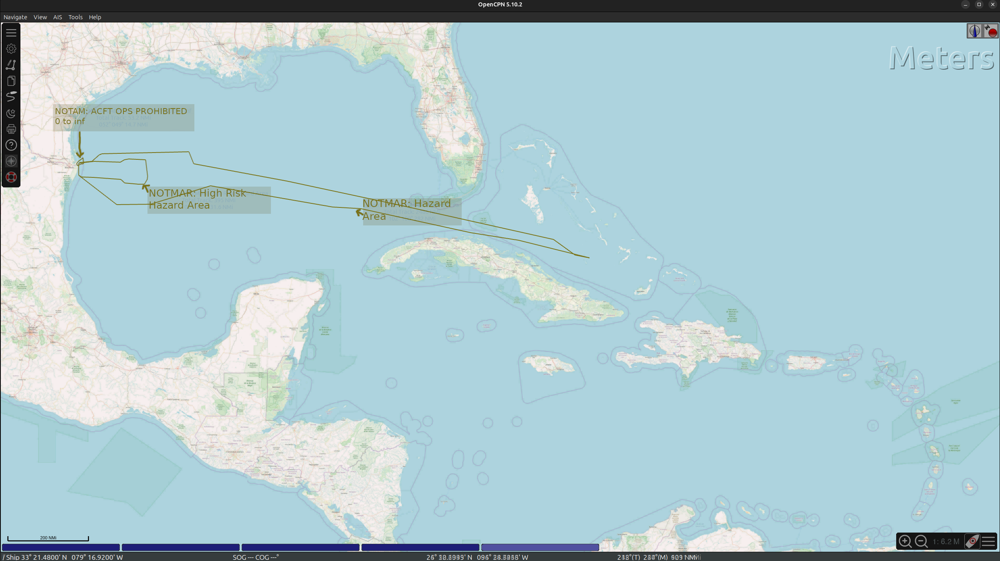

# MAP of NOTMAR and NOTAM SpaceX Starship Test Flight 7
Couldn't find a Map showing the NOTMAR and NOTAM SpaceX gave for [Starship Test Flight 7](https://en.wikipedia.org/wiki/Starship_flight_test_7), here it is:

Note that the air warning (NOTAM) area is significantly smaller than the sea warning (NOTMAR). Please correct me with an issue if you can find more NOTAMs. I used the FAA historic search but couldn't find more. 

## How to reproduce:
1. Find https://www.navcen.uscg.gov/broadcast-notice-to-mariners-message?guid=63760020 and https://tfr.faa.gov/save_pages/detail_5_3363.html 
2. Ask LLM of choice to reformat into gpx (, check?)
3. Install [OpenCPN](https://opencpn.org/) 
4. Download [OpenSeaMap Carribean](https://map2.openseamap.org/#/download/.*/null?lat=35.0245&lon=-63.2636&zoom=3&layers=A10001011000&lang=en)
5. Screenshot and fuse with [GIMP](https://www.gimp.org/)
